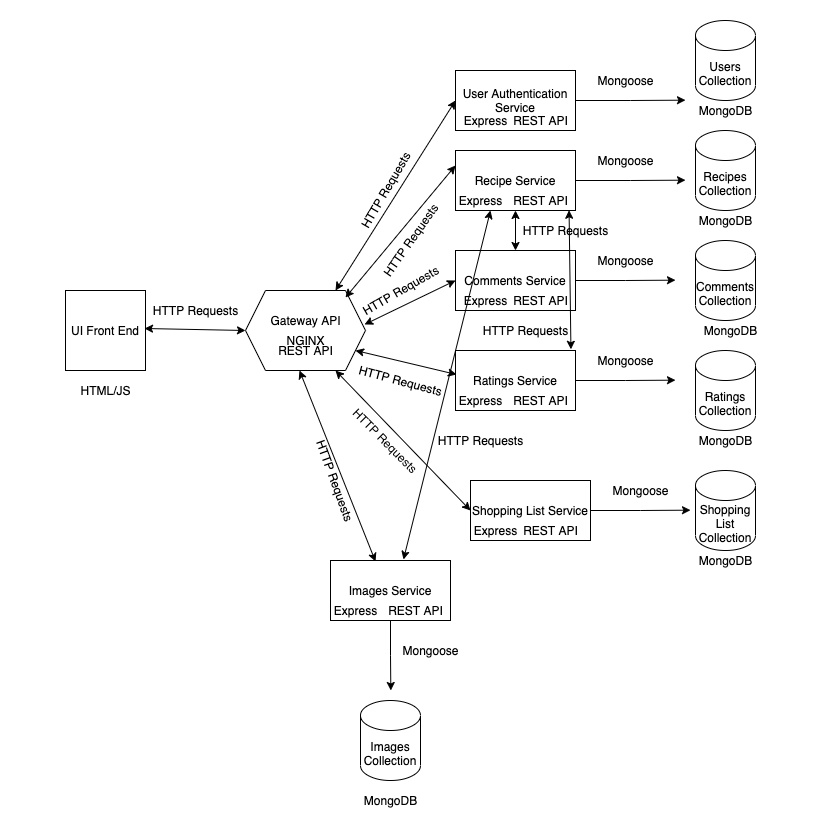

# Cooking Recipe App

## Vision Statement
Our vision is to make cooking from home and finding delicious and healthy recipes an easy and enjoyable experience. Many people today would rather buy expensive take out food over cooking much healthier meals at home. This is usually due to it being easier and more convenient to buy take out than to find the right recipes that coincide with their tastes, dietary preferences, and what ingredients they already keep in their homes. We aim to deliver an extensive recipe filtering system that is fast and accurate, an efficient storage system that allow user's to create and share new recipes, a clear and attractive recipe browsing system that supports rating, and commenting, and a responsive virtual shopping list that users can easily use to keep track of ingredients that may want while browsing recipes. Our team strives to create an application that provides the best recipe finder experience because we understand that people should be able to quickly and easily find the right recipes for them and their familes, and share their own recipes with others to easily find and enjoy as well.

## Principles and Practices Statement
In order to achieve our vision of creating an efficient recipe finding and sharing application, we have created some key principles and practices that will help guide us towards the goals we are trying to achieve. We want to create an efficient, fast, and scalable application that will be able to grow with an increasing number of recipes and quickly filter through this increasing number of recipes in order to quickly find recipes that meet the user's needs and preferences. 

### Principles
We have created some key principles in order to align with our main goals for our application. One important principle we have implemented is that each team member has full control over their own created microservice, but can be assisted by other team members. This will allow us to work efficiently on our own sections of code while being remote and in different timezones. Another principle we have made is that we must design our code with scalability in mind, so that our system can support a large growing number of recipes and be able to change over time. Another principle we have made is that our application must be efficient and fast when filtering large amounts of recipes, since this is the main goal we strive to achieve for our application. One final principle we have created is that every service must exist in its own bounded context and should be responsible for only a single functionality to allow for scalability and change.

### Practices
We also have chosen some key practices that will ensure our principles are being carried out. One practice we have decided on is that MongoDB should be used due to its document storage structure which allows us to nest information such as ingredients and recipe steps within each recipe. MongoDB has efficient filtering capabilities on nested fields which will make filtering recipes by ingredients more efficient. Another important practice we will follow is using NGINX for the API gateway due to its ability to efficiently handle a high volume of connections and its ability to act as a reverse proxy and load balancer, which will help ease microservice scalability. Another practice we created ensures we will use HTTP/REST as the standard integration style due to its ability provide a great deal of flexibility. A REST API can handle multiple types of CRUD calls, return different data formats, and allows our APIs to change internally without affecting the outward API endpoints. 

These principles and practices may change over time, but they will be used as a guideline to ensure every team member is writing code that falls in line with our main goals for the application.

## Prototype Design

Our first prototype for the recipe application is following a design structure that looks like the image above. Here you can see we will provide a front end user interface that will be implemented using HTML and JavaScript. Our user's will interact with this UI to browse, create, and filter our list of recipes, and for each recipe user's will be able to leave comments and ratings. While browsing recipes user's will also have the option to add ingredients into their virtual shopping list. 

All of these front end interactions will be communicating over HTTP to the Gateway API REST server, which then will communicate with all the applications microservices that each handle a different service for the application. This gateway API and each microservice will eventually each run in their own separate Docker containers. The Gateway REST API uses NGINX, a web server that can also be used as a reverse proxy and load balancer, and will take incoming HTTP requests from the front end UI and direct the request to the correct microservice that handles the particular service needed for the request. The fact that NGINX can be used as a reverse proxy and load balancer will allow us to duplicate certain microservices in order to scale the application in the future as it grows. Each microservice provides a REST API with a variety of CRUD endpoints. The gateway API will direct the incoming HTTP request to the correct microservice's API endpoint. Each microservice uses Express, Node's most popular web framework, and communicates with its own MongoDB database using Mongoose, an Object Data Modeling library for MongoDB and Node that is used to translate between objects in code and the representation of those objects in MongoDB. Some microservices, such as the Recipes and Images microservice, will end up communicating with one another as well using HTTP requests to each microservice's REST API endpoint(s). 

We have decided to use HTTP/REST as the standard integration style for our application because it is flexible and can handle a variety of different HTTP calls and multiple types of data, and because it provides standard HTTP verbs that specify how each HTTP endpoint should behave, thus making communication between services much clearer and easier to understand. We also chose it because it does not tie any of microservices or our front end UI to a specific technology, each microservice and the UI will be able to communicate with other services within the application using HTTP/REST calls independent of the architectural backend of either, which is important if we find that using different underlying technologies helps with scalability. API calls from the front end are also not tied to a particular server, they can be directed to an API gateway which can act as a proxy and then a load balancer to distribute incoming HTTP requests for a particular server among a group of servers, which allows for scalability.

Each microservice shown will handle important services needed by the application. The user authentication service will handle user login and authentication. The recipe service will maintain, filter, and supply information regarding the applications stored recipes. This service will handle recipe creation, deletion, and updates, and upon request it can supply a list of all the stored recipe's information and even filter this list of recipes by ingredients or dietary preferences. This service will likely end up communicating with the images service, which will store the images uploaded for each recipe.  The recipe service also will likely communicate with the comments service, which will store comments for each recipe, and the ratings service, which will store ratings for each recipe, in order to get that information for each recipe. Finally, the shopping list service will allow user's to add and remove recipe's from their own virtual shopping lists. The gateway API will communicate with the front end and all of the microservices, as it will recieve incoming HTTP requests from the front end UI and send it to the correct microservice, wait for a response, and then send a response back to the client. 

While this prototype design may change, this version 1 prototype architecture diagram shows the technologies our application will be using, and it shows how each individual microservice that makes up the application will communicate with one another.

## Project Phase Presentation
[Presentation Slides Link](https://docs.google.com/presentation/d/1ZAVOpoEdK-_AqgSSZVpYKRnEdNewYfDFvcJxdSQgusU/edit?usp=sharing)

[Video Link](https://youtu.be/rdxF4Rm3Bj4)

## Exemplars

We have created a variety of exemplars that relate directly to our project and that we thought would be useful references for our team members.

### Recipe Microservice Exemplar
Author: Emily Michaud
 
[Recipe Microservice Exemplar](../exemplars/recipe_microservice_exemplar/doc/README.md)

#### Overview
This Exemplar shows how to communicate with each of the Recipes Microservice endpoints. The Recipes Microservice coordinates inserts, updates, deletes, and retrievals from the Recipes MongoDB collection. This file shows how to send/retrieve data from each of the Recipe Microservice endpoints. There are multiple functions used to show how to create a new recipe and send the recipe to the Recipe Microservice create_recipe endpoint, how to get one or many recipes from the Recipe Microservice, how to recieve a filtered list from the Recipe Microservice, how to update recipes stored in the Recipe Microservice DB, and how to delete recipes from the Recipe Microservice DB. This exemplar is very useful to show the basic structure that all team members should follow when communicating with the Recipe Microservice. Since the Recipe Microservice maintains all the recipe and ingredient information, it will most likely be the most frequently used service in our Recipe Application. Therefore, it is important that each team member understands each of the endpoints that the Recipe Microservice provides and how to send/retrieve data from each of these endpoints.

### Nginx API Gateway Server
Author: Andrew Leger

[Nginx Documentation](https://github.com/emichaud998/cooking_app_group_C/tree/master/exemplars/nginx_gateway_with_docker)

### Overview
The Nginx API server is a simple Nginx server run on a docker container, serving only one endpoint localhost:443/api/recipes/get_recipes

All other api endpoints can be built by adding similarly styled endpoints, and the full implentation of the gateway server does exactly this, adding endpoints for all the endpoints in the recipes service. 

### Image Microservice Exemplar
Author: Thanh Phan
[Image Microservice Exemplar](../exemplars/images_service_exemplar/doc/README.md)

#### Overview
This service will return a list of image url based on the provided query

It uses [Spoonacular](https://spoonacular.com/food-api) as source of image.

Spoonacular only allow 100 free requests per day. Thus, I use mongoDB to save all the results. Thus, in the future, we will no longer rely on Spoonacular

### Comments Microservice Exemplar
Author: Duy Pham 
[Image Microservice Exemplar](../services/Comments/doc/README.md)

#### Overview
This microservice is built for simple comments management system.
It mainly support CRUD operation on Comment object.
