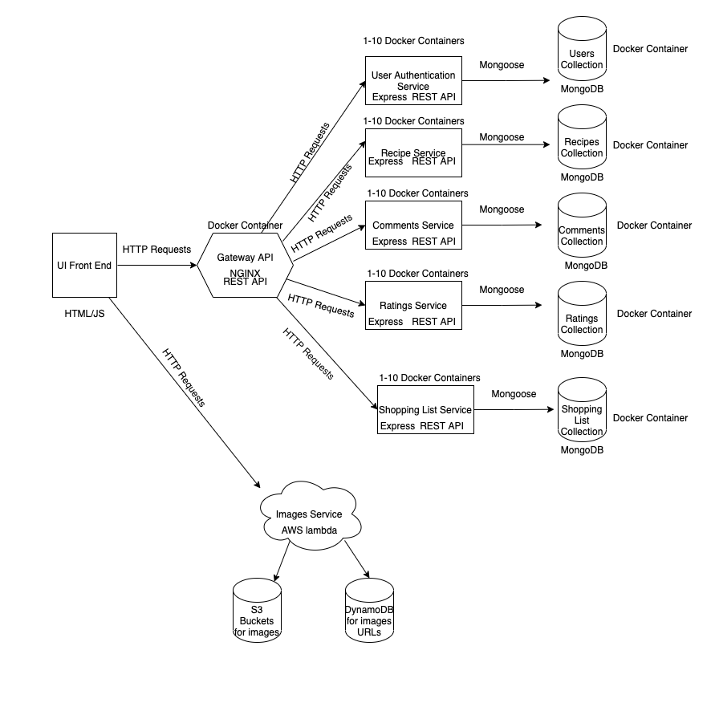

# Cooking Recipe App

## Scalability Write-Up

The parts of the application that could demonstrate the most strain on the system is our Recipes Microservice and the Recipes MongoDB database that the Recipes Microservice uses to store and retrieve Recipe information. This is due to two primary reasons, one being the space for storing an increasing number of recipes, and the other being the filtering and retrieval of recipes from the database. As the number of user's grows, the number of recipes will grow as new user's create and store new recipes, meaning we will likely need to scale our database storage capacity. We also do very complicated filtering queries on the Recipes database, which, as the number of recipes grows, will slow down the system considerably and act as a major bottleneck of the application. Since this recipes service consists mainly of expensive reads--writes to create new recipes will not happen very consistently--we will have to look into how to scale the Recipe MongoDB service to allow for more of these computation heavy reads. One way to do this is to create a replica set for the Recipe MongoDB service, which, according to the [MongoDB manual page](https://docs.mongodb.com/manual/replication/), is a group of mongod processes that maintain the same data set to provide redundancy and high availability. This would help the database to not only be more resilient to failure, but it also would allow for greater read capacity from the database. According to this manual under the "Redundancy and Availability Header", replication provides a level of fault tolerance against the loss of a single database server, and it can provide increased read capacity since clients can send read operations to different replicated database instances. However, having replicated databases can lead to reads from the database sometimes resulting in stale data. According to Sam Newman's Building Microservices textbook in the "Microservices At Scale" chapter under the "Scaling for Reads" section, the replication of new writes from one database to the replicas happens at some point after the write, but not necessarily right away. This means that using replicas may result in reads with stale data until the replication has completed, which then reads will see the consistent data. Since our service simply just returns recipes for users to browse, it can handle missing some newly created recipes, so creating replica sets would be a great option for us as read consistency is not as important to us as database availability and partition tolerance. We may want to create replica sets for each of our service's MongoDB databases in order to make all of our services more resilient to database failure. 

If part of our system goes down, we have docker automatically try to restart on failure, which would allow the failed service to start back up and thus cause the system to recover. Each service of our application has been scaled to run with 10 duplicated containers that are accessed using our Nginx API Gateway which uses load balancing to access the duplicated services. According to Sam Newman's Building Microservices textbook in the "Microservices At Scale" chapter under the "Load Balancing" section, you want to avoid single points of failure in order to have more resillient systems. This means that for microservices that expose synchronous HTTP endpoints, the best way to do this is to have multiple services running each microservice instance, sitting behind a load balancer which will distribute incoming HTTP calls to one or more instances of the services, remove instances when they are no longer healthy, and add them back in when they are. Therefore, our team decided to create multiple instances for each service in order to achieve high availability for each service, and also to reduce total system failure if one of the container instances goes down. If a container does go down, Docker will try to restart it, and in the meantime other instances of the service will ensure that the whole application does not fail.

## System Design Write-Up

Our recipe application system design looks like the image above. Here you can see we provide a front end user interface that is implemented using HTML and JavaScript. Our user's interact with this UI to browse, create, and filter our list of recipes, and for each recipe users will be able to leave comments and ratings. While browsing recipes user's will also have the option to add ingredients into their virtual shopping list. 

All of these front end interactions will be communicating over HTTP to the Gateway API REST server, which then will communicate with the application's microservices that each handle a different service for the application. The only exception to this is the images service, in which the front end will send requests directly to the AWS instance of this service. The gateway API and each of the other microservices run in their own separate Docker containers. Each microservice can be duplicated up to 10 times in order to increase each services availability and resistance to failure. The Gateway REST API uses NGINX in order to recieve incoming HTTP requests from the front end UI and direct the requests to the correct microservice that handles the particular service needed for the request. This Nginx gateway acts as a load balancer that can be used to distribute incoming HTTP calls to a particular service across any duplicated instances of the service. Each microservice uses Express, Node's most popular web framework, and communicates with its own MongoDB database using Mongoose, an Object Data Modeling library for MongoDB and Node that is used to translate between objects in code and the representation of those objects in MongoDB. Each MongoDB database is hosted on its own docker container as well, which will allow us to create replica sets, or groups of mongod processes that maintain the same data set, in order to provide redundancy and high availability to each of the databases.

Each microservice shown handles important services needed by the application. The recipe service maintains, filters, and supplies information regarding the applications stored recipes. This service handles recipe creation, deletion, and updates, supply lists of the services stored recipe information, and even filter the stored recipes by ingredients or dietary preferences. The comments service is used to create and recieve user comments for recipes. The shopping list service allows user's to add and remove recipe's from their own virtual shopping lists. Each of these services run using docker and comunicate using Mongoose to their own MongoDB databases hosted on their own Docker containers. The images service is hosted on AWS instead of running in a Docker container, and is used to grab and store spoontacular images of requested foods in S3 buckets and with DyanmoDB. Services we don't have completed yet include the ratings service, which will store ratings for each recipe, and the user authentication service will handle user login and authentication. 

While the application is not entirely complete yet, this system design will allow us to easily scale our application in order to provide higher availability to an increasing user base, and to provide more resistance to failure. 

## Microservices 
Our application contains the following Microservices:
* [Nginx API Gateway Service](../services/nginx_gateway_with_docker)- Andrew Leger 
* [Front End](../services/frontend)- Andrew Leger
* [Recipes Service](../services/Recipes/README.md) - Emily Michaud 
* [Shopping List Service](../services/Shopping_List/README.md) - Emily Michaud 
* [Comments Service](../services/Comments/README.md)- Duy Pham
* [Images Service](../services/images_service/README.md)- Thanh Phan